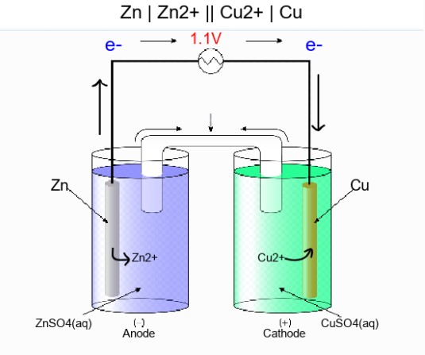

Electrochemistry
========================================

Galvanic (Voltaic) Cells
------------------------
.. py:class:: chemlib.electrochemistry.Galvanic_Cell(self, electrode1: str, electrode2: str)

   :param electrode1 (str): The elemental composition of one of the electrodes of the galvanic cell.
   :param electrode2 (str): The elemental composition of the other electrode of the galvanic cell.
   :raises NotImplementedError: If either of the electrodes is invalid or its reduction potential is unknown.

Make a Galvanic Cell with Lead and Zinc electrodes:

>>> from chemlib import Galvanic_Cell
>>> g = Galvanic_Cell("Pb", "Zn")
>>> 

    .. py:data:: chemlib.electrochemistry.Galvanic_Cell.properties
        :type: dict

A dictionary of the cell's properties:

>>> g.properties
{'Cell': 'Zn | Zn2+ || Pb2+ | Pb', 'Anode': 'Zn', 'Cathode': 'Pb', 'Cell Potential': 0.63}
>>> 

    .. py:data:: chemlib.electrochemistry.Galvanic_Cell.cell_potential
        :type: float

Access the cell potential of the galvanic cell:

>>> g.cell_potential
0.63
>>> g.E0
0.63

    .. py:data:: chemlib.electrochemistry.Galvanic_Cell.diagram
        :type: PIL.Image

The diagram of the galvanic cell is a ``PIL.Image`` object.
To view:

>>> g.diagram.show()
>>> 

To save (as png file):

>>> g.diagram.save("filename.png")
>>> 

Electrolysis
------------
.. py:function:: chemlib.electrochemistry.electrolysis(element: str, n: int, **kwargs) -> dict:

   :param element (str): The symbol of a chemical element.
   :param n (int): The moles of electrons transferred.
   :param kwargs: Provide two of the values from amps, seconds, and grams.
   :raises TypeError: If not only 2 of the parameters in kwargs are specified.

`Example:`
Copper metal is purified by electrolysis. How much copper metal (in grams) could be produced from copper (ii) oxide by applying a current of 10.0 amps at the appropriate negative potential for 12.0 hours?

>>> from chemlib import electrolysis
>>> electrolysis('Cu', 2, amps = 10, seconds=12*60*60)
{'element': 'Cu', 'n': 2, 'seconds': 43200, 'amps': 10, 'grams': 142.25979167746283}
>>> 

`Example:`
How long would it take to electroplate a flute with 28.3 g of silver at a constant current of 2.0 amps using AgNO3?

>>> from chemlib import electrolysis
>>> electrolysis("Ag", 2, amps = 2, grams = 28.3)
{'element': 'Ag', 'n': 2, 'seconds': 25313.582341380206, 'amps': 2, 'grams': 28.3}
>>> 

`Example:`
How much current was used to produce 805 grams of Aluminum metal from Al2O3 in 24 hours?

>>> from chemlib import electrolysis
>>> electrolysis("Al", 3, grams = 805, seconds = 24*60*60)
{'element': 'Al', 'n': 3, 'seconds': 86400, 'amps': 99.95144010616133, 'grams': 805}
>>> 